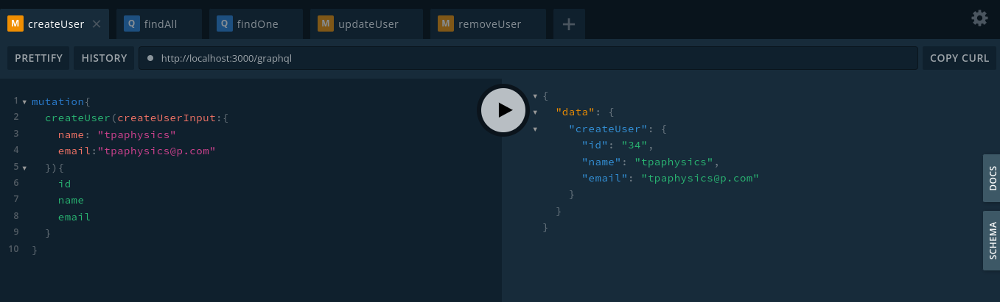

<p align="center">
  <a href="http://nestjs.com/" target="blank"></a>
</p>

[circleci-image]: https://img.shields.io/circleci/build/github/nestjs/nest/master?token=abc123def456
[circleci-url]: https://circleci.com/gh/nestjs/nest

  <p align="center">A progressive <a href="http://nodejs.org" target="_blank">Node.js</a> framework for building efficient and scalable server-side applications.</p>
    <p align="center">


## Descrição

Nessa postagem criamos um CRUD de usuários com o GraphQL utilizando o framework [Nest](https://nestjs.com/). Assim podemos criar, deletar, pesquisar e atualizar uma tabela de usuários no banco de dados. Usamos também o [Prisma](https://www.prisma.io/) como ORM e criamos um container com o banco de dados postgres usando o [Docker Compose](https://docs.docker.com/compose/).

## Instalação

```bash
# Instalação das dependências
$ yarn

# Iniciar container com banco de dados postgress (Você precisa ter o docker instalado!):
$ yarn up:db

# Migração dos models definidos no schema.prisma para o banco de dados
$ yarn prisma migrate dev
```

## Iniciando o servidor

```bash
# development
$ yarn start

# watch mode
$ yarn start:dev

# production mode
$ yarn start:prod
```

## Observação

```bash
# Para remover o container criado:
$ yarn rm:db
```

## Routes

```
Mapped {/graphql, POST} route +1ms
```

Diferentemente das Rest APIs onde existem os métodos get, post, path, update, delete em uma API QraphQL existe somente o método post com <strong>querys</strong> e <strong>mutations</strong>.

```graphql
type User {
  id: ID!
  email: String!
  name: String!
}

type Query {
  users: [User!]!
  user(id: Int!): User!
}

type Mutation {
  createUser(createUserInput: CreateUserInput!): User!
  updateUser(updateUserInput: UpdateUserInput!): User!
  removeUser(id: Int!): User!
}

input CreateUserInput {
  name: String!
  email: String!
}

input UpdateUserInput {
  id: Int!
  email: String
  name: String
}
```

Abra o navegador em http://localhost:3000/graphql e realize as chamadas abaixo:



```graphql
#createUser
mutation {
  createUser(
    createUserInput: { name: "tpaphysics", email: "tpaphysics@t.com" }
  ) {
    id
    name
    email
  }
}

#findAll
query {
  users {
    id
    email
    name
  }
}

#findOne
query {
  user(id: 12) {
    id
    email
    name
  }
}

#updateUser
mutation {
  updateUser(updateUserInput: { id: 1, name: "tpaphysics" }) {
    id
    name
    email
  }
}

#removeUser
mutation {
  removeUser(id: 2) {
    id
    name
    email
  }
}
```

## **👨‍🚀 Autor**

<a href="https://github.com/tpaphysics">

  <br />
  <sub>
    <b>Thiago Pacheco de Andrade</b>
  </sub>
</a>
<br />

👋 Meus contatos!

[](https://www.linkedin.com/in/thiago-pacheco-200a1a86/)
[](mailto:physics.posgrad.@gmail.com)

## Licença

Veja o arquivo [MIT license](LICENSE).
